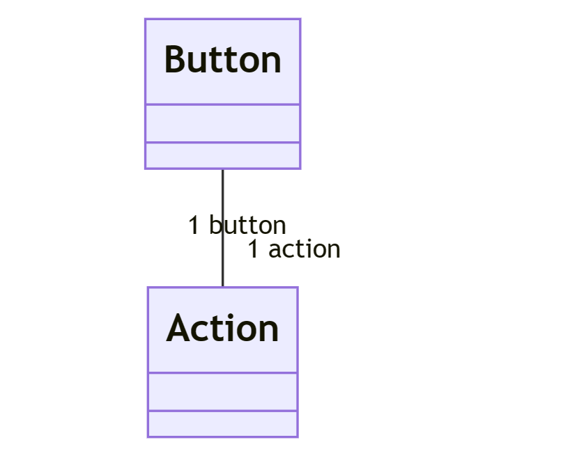

Dans notre cas, comme un `Button` peut exister sans `Action` et une `Action` sans `Button`, le problème de handshake (ou
dépendance cyclique) est facile à régler.

Un cas qui serait plus complexe est celui où les deux classes ne peuvent pas avoir d'instance sans une instance de 
l'autre classe. Dans ce cas, il faut décider quelle classe doit être capable d'être créée sans l'autre (généralement 
celle qui a le plus de choses à paramétrer), puis paramétrer l'autre instance depuis celle qu'on a créée.

Exemple :


```java
// On va considérer que c'est la classe Button qui nécessite le moins de configuration
public class Button {
    private Action action;
    
    public Button(Action action) {}
}

public class Action {
    private Button button;
    
    public Action() {
        this.button = new Button(this); // On utilise `this` directement, qui référence l'instance qu'on est en train de créer.
    }
}
```

> **NOTE :**
> 
> Exercice 4 :
> - Pour la question 1, il suffit de retirer tous les contrôles dans les méthodes set des `Button` et `Action`
> - Pour la question 2, bonne chance (enfin c'est pas compliqué en soi mais j'ai un peu la flemme de le faire, vous me demandrez si vous le voulez vraiment).
> - Pour la question 3 vaut mieux demander à quelqu'un d'autre, les contraintes OCL c'est pas mon truc
> - Idem pour la question 4
> 
> Exercice 5 :
> - Pour la question 1, j'ai pas jugé pertinent de le faire parce que y'en avait pas spécialement besoin.
> - Pour la question 2, les sources des tests sont dans le dossier test.
> - Pour la question 3, bah du coup c'est déjà fait de base
> - Pour la question 4, pareil, j'aurais pas les mêmes que celles que le prof attend, mais elles sont bien là.
